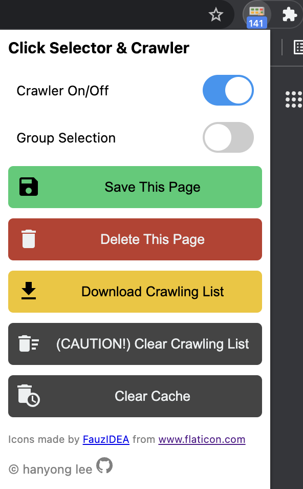

# Click Selector & Crawler

## Installation

Install after enabling developer mode in <chrome://extensions>.

## Features

1. A switch to turn crawling on and off
1. Switch to turn group selection (sibling selection) on and off
1. Save the crawled data of current page to chrome local storage
1. Delete the crawled data and cache of the current page
1. Download a list of all pages crawled so far to computer
1. Delete all crawled list so far from chrome local storage
1. Delete all crawl cache so far from chrome local storage

## Keyboard Shortcuts

### Toggle crawling

- Windows, Linux: Ctrl+Shift+O
- MacOS: Command+Shift+O

### Toggle group selection (Sibling selection)

- Windows, Linux: Ctrl+Shift+E
- MacOS: Command+Shift+E

### Save crawled elements of current page to chrome local storage

- Windows, Linux: Ctrl+Shift+S
- MacOS: Command+Shift+S

## Debugging

- Whenever a DOM element on a page is selected, the page's cache is printed to the console.
- When you click the "Click Selector & Crawler" title in the extension popup, all data stored in Chrome's local storage is displayed in the **popup console**.

## An example of the save file format

```json
{
  "https://example.com": {
    "p~~0": {
      "nth-child": 0,
      "selector": "p",
      "text": "This is an example."
    },
    "p~~1": {
      "nth-child": 1,
      "selector": "p",
      "text": "This is an example 2."
    }
  },
  "https://example.net": {
    "h1~~0": {
      "nth-child": 0,
      "selector": "h1",
      "text": "This is an example text."
    }
  }
}
```

## Screenshot


